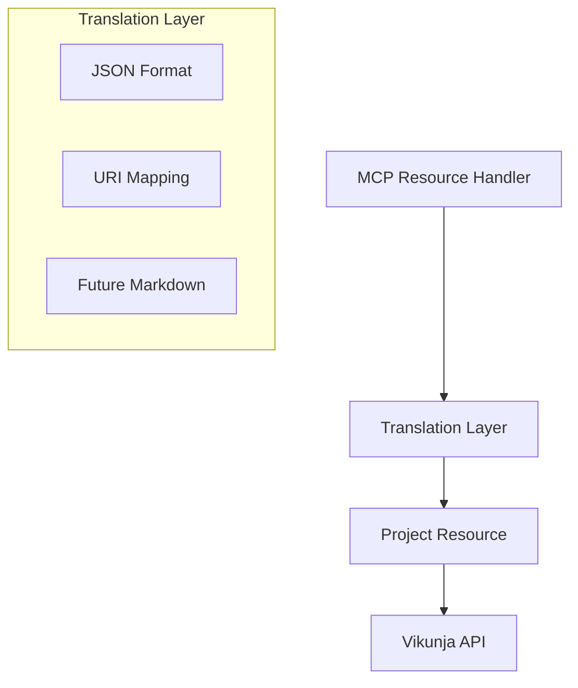

# Vikunja MCP Server Active Context

## Current Focus

Implementing connection between MCP project resource handler and project resource class to enable real data access through the MCP protocol.

## Implementation Plan

### 1. Translation Layer (Initial JSON Phase)

- Create src/mcp/translation/project.ts
- Implement basic JSON serialization
- Set up URI mapping utilities
- Design for future Markdown compatibility
- Define clear interfaces for testability

### 2. Project Resource Handler Integration

- Connect to ProjectResource class
- Implement token handling through extra params
- Add comprehensive error handling
- Set up direct URI mapping (vikunja://projects/{id})
- Integrate with translation layer

### 3. E2E Testing Infrastructure

- Create dedicated E2E test user
- Set up test data management
- Update test expectations for real data
- Add URI parsing unit tests
- Ensure proper test isolation

## Active Decisions

1. Translation Layer Strategy

   - Implementing basic layer now for:
     - Clear separation of concerns
     - Easier testing
     - Future-proofing for Markdown format
   - Start with direct JSON serialization
   - Plan upgrade path to Markdown format

2. Testing Architecture

   - Separate users for E2E and integration tests
   - Full test data lifecycle management
   - Comprehensive error scenario coverage

3. URI Management
   - Direct mapping in initial version
   - Future flexibility for complex transformations
   - Robust error handling for invalid URIs

## Technical Design

## Implementation Steps

1. Translation Layer

   - Create base translation utilities
   - Implement JSON serialization
   - Set up URI mapping functions
   - Add error handling

2. Resource Handler

   - Update handler to use translation layer
   - Add ProjectResource integration
   - Implement token handling
   - Add error management

3. Testing
   - Create E2E test user management
   - Set up test data helpers
   - Update test expectations
   - Add URI parsing tests

## Technical Considerations

1. Error Handling Strategy

   - URI parsing validation
   - API communication errors
   - Authentication failures
   - Data validation issues
   - Translation error handling

2. Performance Optimization

   - Minimize translation overhead
   - Efficient URI parsing
   - Future caching considerations

3. Testing Coverage

   - User isolation between test types
   - Complete data lifecycle management
   - Comprehensive error scenarios
   - Real data validation approach

4. Future Extensibility
   - Markdown translation preparation
   - Complex URI transformations
   - Resource relationship handling
   - Additional Vikunja features support

### Technical Design

1. MCP Server Design

   - FastMCP for server implementation
   - JSON format for initial responses
   - Resource-based URI structure (vikunja://projects/{id})
   - Error mapping to MCP protocol

2. Resource Layer Integration
   - Direct resource method calls
   - Response format mapping
   - Error propagation
   - Dependency injection for testing

### Testing Strategy

1. Unit Tests (Resources)

   - Test handler functions directly
   - Focus on data transformation
   - Mock external dependencies
   - Verify response formats

2. E2E Tests (Server)
   - Test full request/response flow
   - Use real StdioClientTransport
   - Verify resource registration
   - Test client interactions

### Implementation Strategy

1. Simplify server implementation
2. Move to dedicated resource files
3. Start with JSON responses
4. Plan for Markdown transition
5. Maintain clear separation of concerns

### Open Questions

1. Future Markdown format conversion strategy?
2. Pagination handling in MCP resources?
3. Resource relationship representation?

## Current Work Items

### Recently Completed

- Implemented client-side rate limiting with 500 req/min default
- Added RateLimiter class with counter-based implementation
- Created unit tests for rate limiter functionality
- Added integration tests for rate limiting with real Vikunja server
- Task resource implementation
- Integration tests for Task resource
- Project_id validation in Task resource
- Direct response handling in resources
- Unit test updates for unwrapped responses
- Resource layer testing streamlined
- Implemented CI/CD pipeline

### In Progress

- MCP server implementation planning
- FastMCP integration design
- Test infrastructure setup

### Blocked

None currently

### Next Up

1. MCP server test implementation
2. FastMCP server integration
3. Resource exposure
4. End-to-end testing
