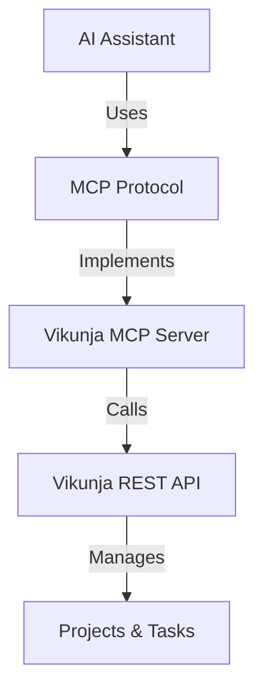

# Vikunja MCP Server Product Context

## Purpose

The Vikunja MCP server enables AI assistants to interact with Vikunja project management tool programmatically through the Model Context Protocol. This bridges the gap between AI capabilities and project management functionality.

## Problems Solved

1. **AI Integration Gap**

   - Enables AI assistants to manage projects and tasks in Vikunja
   - Provides structured access to Vikunja's functionality
   - Standardizes interaction patterns through MCP

2. **Automation Needs**

   - Allows programmatic control of Vikunja
   - Enables automated project management workflows
   - Facilitates bulk operations through AI assistance

3. **Integration Complexity**
   - Simplifies Vikunja API integration
   - Provides type-safe interface
   - Handles authentication and configuration

## User Experience Goals

1. **For AI Assistants**

   - Clear, consistent resource/tool interfaces
   - Predictable error handling
   - Type-safe operations
   - Comprehensive entity coverage

2. **For Developers**
   - Simple setup process
   - Clear configuration options
   - Extensive documentation
   - Type safety and IDE support

## Interaction Model

1. AI assistant uses MCP tools/resources
2. MCP server translates to API calls
3. Vikunja API performs operations
4. Results flow back through MCP
