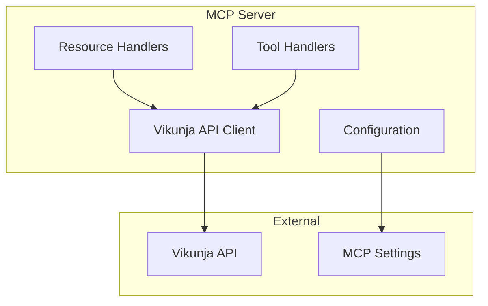

# Vikunja MCP Server System Patterns

## Architecture Overview

## Core Patterns

### 1. Resource Pattern

- Expose Vikunja entities as MCP resources
- URIs follow pattern: `vikunja://{entity}/{id}`
- Resources are read-only snapshots
- Include essential metadata

### 2. Tool Pattern

- CRUD operations implemented as tools
- Consistent input/output schemas
- Error handling and validation
- Idempotent operations where possible

### 3. Configuration Pattern

- Environment-based configuration
- Validation at startup
- Secure credential handling
- Defaults with overrides

### 4. API Client Pattern

- Centralized API communication
- Type-safe request/response handling
- Error normalization
- Rate limiting consideration

## Design Decisions

1. **Type Safety**

   - Use TypeScript strict mode
   - Generate types from OpenAPI spec
   - Runtime type validation

2. **Testing Strategy**

   - Unit tests for business logic
   - Integration tests for API interaction
   - Mock MCP context for testing

3. **Error Handling**

   - Standardized error responses
   - Clear error messages
   - Error categorization

4. **Code Organization**
   - Feature-based structure
   - Clear separation of concerns
   - Dependency injection ready
