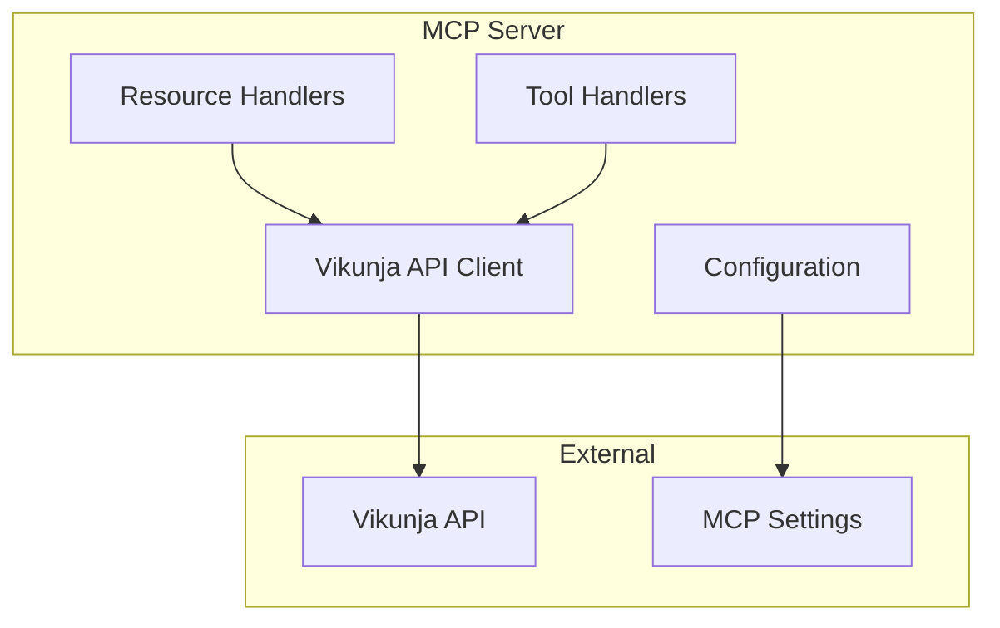

# Vikunja MCP Server System Patterns

## Architecture Overview

## Core Patterns

### 1. Resource Pattern

- Expose Vikunja entities as MCP resources
- URIs follow pattern: `vikunja://{entity}/{id}`
- Resources are read-only snapshots
- Include essential metadata
- Direct API response handling
- Type-safe CRUD operations

### 2. Tool Pattern

- CRUD operations implemented as tools
- Consistent input/output schemas
- Error handling and validation
- Idempotent operations where possible

### 3. Configuration Pattern

- Environment-based configuration
- Validation at startup
- Secure credential handling
- Defaults with overrides

### 4. API Client Pattern

- Centralized API communication
- OpenAPI-generated type definitions
- Type-safe request/response handling
- Error normalization
- Rate limiting consideration
- Direct response mapping

## Testing Patterns

### 1. Unit Testing Strategy

- Write tests before implementation
- Small, focused test cycles
- Immediate debugging and validation
- Continuous test coverage maintenance
- MSW-based API testing
- Factory-based test data
- Standardized error handling

### 2. Integration Testing Strategy

Key Components:

- Test helper for user management
- Fixed test user approach
- Direct API interaction
- Real response validation
- Error case testing
- Logging and debugging support

Patterns:

1. User Management

   - Create test user if not exists
   - Reuse existing user if possible
   - Maintain authentication state

2. Test Organization

   - Group by resource type
   - Separate basic and error cases
   - Clear test case isolation
   - Comprehensive logging

3. Response Handling
   - Direct API response mapping
   - Type-safe response validation
   - Error response testing
   - Response structure verification

## Design Decisions

1. **Type Safety**

   - Use TypeScript strict mode
   - Generate types from OpenAPI spec
   - Runtime type validation with Zod
   - Auto-updated type definitions
   - Type-safe test factories

2. **Testing Strategy**

   - Unit Testing with MSW

     - One MSW handler per test case
     - Group by endpoint/method
     - Cover success and error paths
     - Type-safe request/response handling
     - Clear test data setup using factories
     - Test organization by resource (project.test.ts, task.test.ts)
     - Core client testing (client.test.ts)

   - Integration Testing with Local Vikunja

     - Test against actual API behavior
     - Fixed test user pattern
     - Direct API response handling
     - Real-world response validation
     - Docker-based test environment
     - Reference implementation validation
     - Debug logging for troubleshooting

   - Error Handling Patterns

     - Network errors (Failed to fetch)
     - Invalid JSON responses
     - HTTP error codes (400, 404, 500)
     - Authentication errors
     - Validation errors

   - Development Cycle
     - Test-first development
     - Small, focused test iterations
     - Immediate debugging and validation
     - Reusable test utilities
     - Mock MCP context for testing

3. **Error Handling**

   - Standardized error responses
   - Clear error messages
   - Error categorization
   - Type-safe error handling
   - Test coverage for error cases
   - Integration error validation

4. **Code Organization**
   - Feature-based structure
   - Clear separation of concerns
   - Dependency injection ready
   - Test utilities organization
   - Shared factory patterns
   - Integration test helpers
