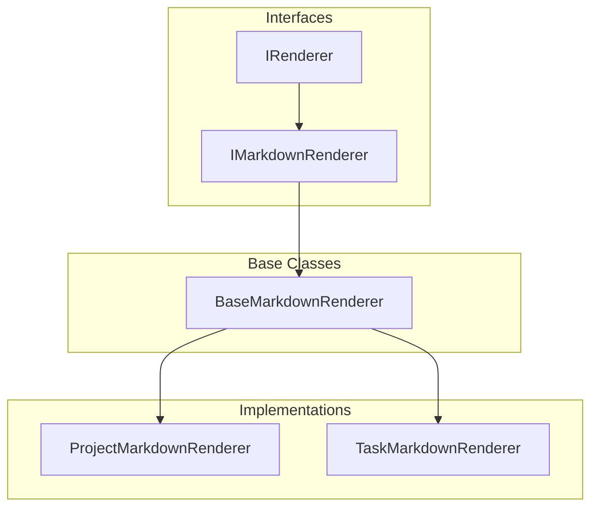

# Vikunja MCP Server System Patterns

## Architecture Overview

## Core Patterns

### 1. Rendering Layer Pattern

The rendering layer follows a clear object-oriented design for handling different output formats and entity types:

Key Components:

1. Core Interfaces

   - IRenderer: Base rendering interface
   - IMarkdownRenderer: Markdown-specific extensions

2. Base Implementation

   - BaseMarkdownRenderer: Common markdown functionality
   - Shared utilities and helpers

3. Entity-Specific Renderers
   - ProjectMarkdownRenderer: Project-specific rendering
   - TaskMarkdownRenderer: Task-specific rendering
   - Future renderers for other entities

Benefits:

- Clear separation of concerns
- Extensible architecture
- Reusable components
- Strong type safety
- Easy testing
- Future-proof design

### 2. MCP Resource Pattern

- FastMCP-based resource implementation
- URIs follow pattern: `vikunja://{entity}/{id}`
- Integration with existing resource layer
- JSON format for initial responses
- Resources are read-only snapshots
- Direct mapping to Vikunja resources

### 2. Resource Layer Integration Pattern

- Dependency injection for resource access
- Reuse existing resource implementations
- Maintain type safety across layers
- Error propagation and mapping

### 3. Configuration Pattern

- FastMCP server configuration
- Vikunja API configuration integration
- Zod schema validation
- Environment-based configuration

### 4. Rate Limiting Pattern

- Conservative default rate limiting (500 requests/minute)
- Client-side rate limiting implementation
- Simple counter-based approach
- Easy configuration through VikunjaConfig

### 5. Error Handling Pattern

- Error Class Hierarchy

  - VikunjaError base class with immutable error code
  - Specific error types for different scenarios
  - Type-safe error inheritance chain
  - Clear error categorization

- Error Code Management

  - Support for Vikunja-specific error codes (3000+)
  - HTTP status code mapping
  - Custom error code preservation
  - Immutable error codes

- Error Propagation

  - FastMCP error mapping
  - Resource layer error propagation
  - User-friendly error messages
  - Consistent error structure
  - Type-safe error handling

- Error Testing Strategy
  - Comprehensive test coverage
  - Error code verification
  - Response format validation
  - Edge case handling

## Testing Patterns

### 1. MCP Server Testing Strategy

- Mock project resources using factories
- Test resource availability and listing
- Validate resource reading
- Error case coverage
- Configuration validation testing
- FastMCP utility usage

### 2. Integration Testing Strategy

Key Components:

- FastMCP test utilities
- End-to-end flow validation
- Real Vikunja instance testing

Patterns:

1. Server Testing

   - FastMCP server setup
   - Resource handler testing
   - Configuration validation
   - Error scenario testing

2. Test Organization

   - Resource-based grouping
   - Error case isolation
   - Configuration testing
   - End-to-end validation

3. Response Validation
   - JSON format verification
   - Resource data validation
   - Error response testing
   - Configuration validation

## Design Decisions

1. **Type Safety**

   - Use TypeScript strict mode
   - Generate types from OpenAPI spec
   - Runtime type validation with Zod
   - Auto-updated type definitions
   - Type-safe test factories

2. **Testing Strategy**

   - Unit Testing with MSW

     - One MSW handler per test case
     - Group by endpoint/method
     - Cover success and error paths
     - Type-safe request/response handling
     - Clear test data setup using factories
     - Test organization by resource (project.test.ts, task.test.ts)
     - Core client testing (client.test.ts)

   - Integration Testing with Local Vikunja

     - Test against actual API behavior
     - Fixed test user pattern
     - Direct API response handling
     - Real-world response validation
     - Docker-based test environment
     - Reference implementation validation
     - Debug logging for troubleshooting

   - Error Handling Patterns

     - Network errors (Failed to fetch)
     - Invalid JSON responses
     - HTTP error codes (400, 404, 500)
     - Authentication errors
     - Validation errors

   - Development Cycle
     - Test-first development
     - Small, focused test iterations
     - Immediate debugging and validation
     - Reusable test utilities
     - Mock MCP context for testing

3. **Error Handling**

   - Standardized error responses
   - Clear error messages
   - Error categorization
   - Type-safe error handling
   - Test coverage for error cases
   - Integration error validation

4. **Code Organization**
   - Feature-based structure
   - Clear separation of concerns
   - Dependency injection ready
   - Test utilities organization
   - Shared factory patterns
   - Integration test helpers
