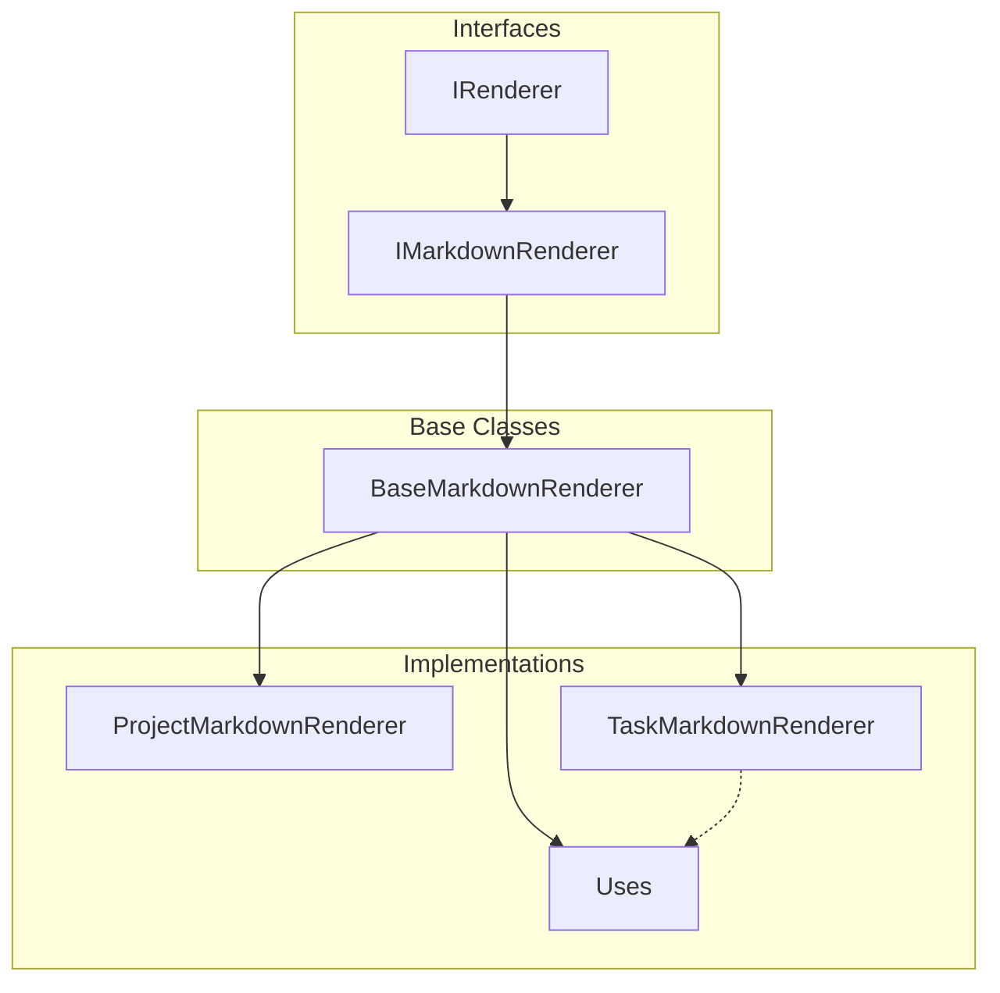

# Renderers System

The renderers system provides a flexible and extensible way to format MCP resources in different output formats, starting with Markdown.

## Architecture



## Components

### Core Interfaces

- `IRenderer<T>`: Base interface for all renderers

  - `render(data: T): string` - Render a single item
  - `renderList(items: T[]): string` - Render a list of items

- `IMarkdownRenderer<T>`: Markdown-specific renderer interface
  - Extends `IRenderer<T>`
  - Adds `renderAsListItem(item: T): string`
  - Optional `renderAsTree?(item: T): string`

### Base Classes

- `BaseMarkdownRenderer<T>`: Abstract base class for Markdown renderers
  - Implements common functionality
  - Provides default list rendering behavior
  - Enforces consistent Markdown formatting

### Entity Renderers

- `ProjectMarkdownRenderer`: Renders Project entities

  - List items as links to projects
  - Full JSON for single project view (temporary)
  - Future: Rich Markdown for single project view

- `TaskMarkdownRenderer`: Renders Task entities

  - List items in GitHub task list format (- [ ] / - [x])
  - Task titles as links with proper Markdown escaping
  - Full details including due dates, labels, and assignees
  - Uses LabelMarkdownRenderer for label formatting

- `LabelMarkdownRenderer`: Renders Label entities
  - Hashtag format (#label-name)
  - Sanitizes label text (strips special chars, replaces spaces)
  - Optional description in full render mode

### Utilities

- `markdown-helpers.ts`: Common Markdown formatting utilities
  - `escapeMarkdown(text: string): string`
  - `createLink(text: string, url: string): string`
  - `createListItem(text: string, level?: number): string`
  - `createHeading(text: string, level?: number): string`
  - `createCodeBlock(text: string, language?: string): string`

## Usage

```typescript
// Project rendering
const projectRenderer = new ProjectMarkdownRenderer();
const markdown = projectRenderer.renderList(projects);

// Task rendering with labels
const taskRenderer = new TaskMarkdownRenderer();
const taskMarkdown = taskRenderer.render(task);
// Output:
// # Task Title
// - [ ] Due: 2025-12-31
//
// Task description here...
// Progress: 75%
// #important #in-progress
// Assigned to: @user1, @user2
```

## Markdown Escaping Strategy

The renderers follow a consistent strategy for handling Markdown special characters:

1. **Utility Functions**: Base utilities like `createLink`, `createHeading`, etc. do not perform escaping

   ```typescript
   createLink('Text with *stars*', 'url'); // -> [Text with *stars*](url)
   ```

2. **Explicit Escaping**: The `escapeMarkdown` utility handles special characters:

   ```typescript
   escapeMarkdown('Text with *stars*'); // -> Text with \*stars\*
   ```

3. **Renderer Responsibility**: Each renderer is responsible for escaping its content:
   ```typescript
   // In TaskMarkdownRenderer:
   const title = task.title ? task.title : 'Untitled';
   const taskLink = createLink(escapeMarkdown(title), toMcpUri(task.id));
   ```

This approach ensures:

- Clear responsibility for escaping
- No double-escaping issues
- Consistent rendering across the application

## Future Extensions

1. Rich project rendering

   - Description as body text
   - Tasks as checklist
   - Child projects as tree

2. Additional formats
   - HTML renderer
   - Plain text renderer
   - Custom format renderers

## Design Decisions

1. Separate rendering from data access

   - Clean separation of concerns
   - Independent testing
   - Format-agnostic resources

2. Composition over inheritance

   - Base renderer + utilities
   - Easy to add new formats
   - Reusable components

3. Strong typing
   - Generic interfaces
   - Type-safe rendering
   - Clear contracts
