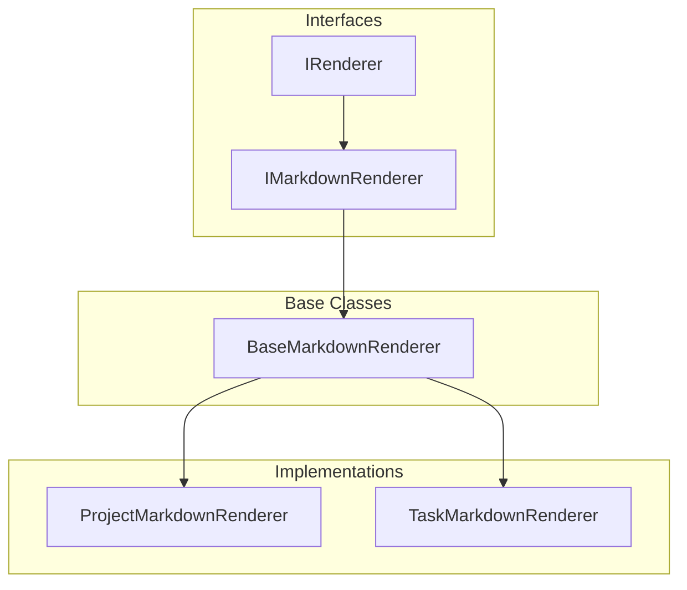

# Renderers System

The renderers system provides a flexible and extensible way to format MCP resources in different output formats, starting with Markdown.

## Architecture



## Components

### Core Interfaces

- `IRenderer<T>`: Base interface for all renderers

  - `render(data: T): string` - Render a single item
  - `renderList(items: T[]): string` - Render a list of items

- `IMarkdownRenderer<T>`: Markdown-specific renderer interface
  - Extends `IRenderer<T>`
  - Adds `renderAsListItem(item: T): string`
  - Optional `renderAsTree?(item: T): string`

### Base Classes

- `BaseMarkdownRenderer<T>`: Abstract base class for Markdown renderers
  - Implements common functionality
  - Provides default list rendering behavior
  - Enforces consistent Markdown formatting

### Entity Renderers

- `ProjectMarkdownRenderer`: Renders Project entities
  - List items as links to projects
  - Full JSON for single project view (temporary)
  - Future: Rich Markdown for single project view

### Utilities

- `markdown-helpers.ts`: Common Markdown formatting utilities
  - `escapeMarkdown(text: string): string`
  - `createLink(text: string, url: string): string`
  - `createListItem(text: string, level?: number): string`
  - `createHeading(text: string, level?: number): string`
  - `createCodeBlock(text: string, language?: string): string`

## Usage

```typescript
// Creating a renderer
const renderer = new ProjectMarkdownRenderer();

// Rendering a list of projects
const projects = await projectResource.list();
const markdown = renderer.renderList(projects);

// Rendering a single project
const project = await projectResource.get(1);
const markdown = renderer.render(project);
```

## Future Extensions

1. Rich project rendering

   - Title as heading
   - Description as body text
   - Tasks as checklist
   - Child projects as tree

2. Task renderer

   - Checkbox lists
   - Labels as tags
   - Due dates and priorities

3. Additional formats
   - HTML renderer
   - Plain text renderer
   - Custom format renderers

## Design Decisions

1. Separate rendering from data access

   - Clean separation of concerns
   - Independent testing
   - Format-agnostic resources

2. Composition over inheritance

   - Base renderer + utilities
   - Easy to add new formats
   - Reusable components

3. Strong typing
   - Generic interfaces
   - Type-safe rendering
   - Clear contracts
